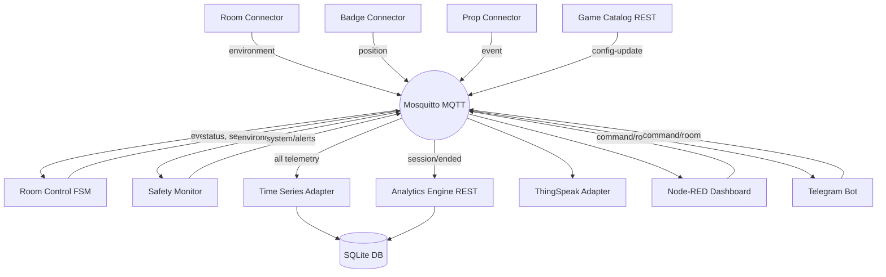

# IoT Escape Room Platform

A robust, microservices-based, event-driven architecture for running real-world or simulated Escape Rooms.

## Architecture

The system operates via an MQTT message bus connecting independent containerized microservices.



## Running the Stack

Requires Docker and docker-compose.

```bash
docker-compose up -d --build
```

This will launch all services including:
- Mosquitto Broker (`:1883`)
- Game Catalog (`:8080`)
- Node-RED Dashboard (`:1880`)
- Analytics (`:8084`)

## Verification

The project includes an automated test suite verifying every phase of the project implementation.
Run individual phase verifications:
```bash
python3 tests/phase_gates/verify_phase_15.py
```
