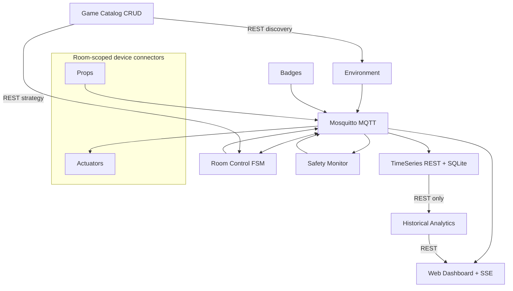

# IoT Platform for Live-Action Game Rooms

A Dockerized, object-oriented Python microservice platform for managing two
concurrent escape rooms. It tracks players, monitors BME680-class environmental
sensors, processes interactive props, controls room actuators, enforces safety
rules and calculates historical game analytics.

The original proposal listed Node-RED, Telegram and ThingSpeak. Their complete
operator-facing functionality is intentionally replaced by the robust Web
Dashboard: live Server-Sent Events, critical alert banners, device presence,
room controls, historical charts, player heatmaps and game analytics. No
ThingSpeak, Telegram or Node-RED account is required.

## Team

- Paolo Monteduro - 360415
- Ludovico Pollastro - 361775

The team reduction from four to two members was discussed with the professor.
The platform remains scalable: adding a room requires Catalog configuration and
one configured instance of each room-scoped connector, not source-code changes.

## Quick start

Requirements: Docker Engine with Docker Compose v2.

```bash
docker compose up --build -d
docker compose ps
```

Open <http://localhost:8087>. The dashboard becomes healthy after Catalog,
TimeSeries and Analytics have passed their health checks.

Useful commands:

```bash
docker compose logs -f --tail=100
python game_center_simulator.py
python tests/integration/verify_stack.py
docker compose down
```

Use `docker compose down -v` only when you intentionally want to reset the
Catalog configuration, retained MQTT data and historical database.

## Implemented rooms

| Room | Theme | Badges | Prop sequence |
| --- | --- | ---: | --- |
| `room1` | Vault 101 / Fallout | `b1`, `b2` | `pipboy` RFID -> `terminal` button -> timed transition -> `geiger_counter` capacitive |
| `room2` | Spencer Mansion / Resident Evil | `b3`, `b4` | `typewriter` button -> timed transition -> `crest_socket` RFID -> `crank_hole` rotary |

Both rooms run concurrently and use distinct MQTT client IDs, retained FSM
states, session IDs and correlated historical records.

## Architecture at a glance



Every service/resource self-registers in the Catalog. Sensor measurements use
RFC 8428 JSON SenML. Semantic commands, alerts, game status and session events
use documented JSON objects. Runtime information crosses service boundaries
only through MQTT or REST; Analytics never opens the TimeSeries SQLite file.

See [architecture](docs/architecture.md), [MQTT contract](docs/mqtt_topics.md),
[REST API](docs/rest_api.md), [FSM contract](docs/fsm.md) and the complete
[correction and verification report](CORRECTION_REPORT.md).

## Local endpoints

| Component | URL |
| --- | --- |
| Catalog | `http://localhost:8080` |
| TimeSeries API | `http://localhost:8085` |
| Analytics API | `http://localhost:8086` |
| Web Dashboard | `http://localhost:8087` |
| Room 1: environment / actuator / badge / prop | ports `8101` / `8102` / `8103` / `8104` |
| Room 2: environment / actuator / badge / prop | ports `8201` / `8202` / `8203` / `8204` |
| MQTT broker | `127.0.0.1:1883` |

Host ports bind to `127.0.0.1`; the broker and operator APIs are not exposed on
all network interfaces by default.

## Tests

Install the local verification dependencies in a virtual environment:

```bash
python -m venv .venv
. .venv/bin/activate
pip install -r requirements-dev.txt
python -m pytest
ruff check .
```

After the Compose stack is healthy, run the black-box test:

```bash
python tests/integration/verify_stack.py
```

It verifies actual downstream effects: Catalog self-registration, two-room
isolation, dashboard-to-MQTT-to-FSM delivery, timed transitions, session
persistence, REST-based analytics, non-empty heatmaps, SSE reception and the
fall -> alert -> independent emergency-unlock path.

The GitHub Actions workflow in `.github/workflows/ci.yml` repeats static,
frontend and full Docker Compose verification on every push and pull request.

## Configuration and scalability

- `config/rooms.json`: room/device correlations and dimensions.
- `config/strategy_room1.json`, `strategy_room2.json`: validated FSM rules.
- `config/mosquitto.conf`: private Compose broker settings.
- `.env.example`: optional safety/retention thresholds.

Catalog owns its runtime configuration volume. Strategies are retrieved through
`GET /config/<room_id>` and updated through `PUT /config/<room_id>`; Room Control
hot-reloads the retained `catalog/<room_id>/config-update` notification.

## Hardware mode

The default providers simulate BME680, badge and prop readings so the complete
project is demonstrable without laboratory hardware. On Raspberry Pi, replace
only the provider class inside the relevant Device Connector; the Pi remains a
device connector and does not host the other microservices.
