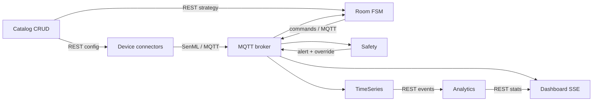

# Architecture

## Design decisions

The platform follows the proposal's microservice pattern and runs one Room
Control, Environment Connector, Badge Connector, Prop Connector and Room
Actuator Connector instance per room. Each instance has a unique MQTT client ID
containing its room ID.

Node-RED, Telegram and ThingSpeak are replaced by one robust Web Dashboard:

- Node-RED replacement: room state, device telemetry and manual MQTT controls;
- Telegram replacement: live critical alert banners and a persistent alert feed;
- ThingSpeak replacement: TimeSeries storage, historical charts, heatmaps and
  post-game analytics.

## Information flow

SQLite is private to TimeSeries. Analytics obtains historical events only over
REST. Strategy JSON files are private seed/persistence data of Catalog; Room
Control obtains strategies only over REST. These boundaries satisfy the rule
against inter-service information exchange through local files.

## Logical microservices

| Microservice | Input | Processing | Output |
| --- | --- | --- | --- |
| Game Catalog | REST CRUD, MQTT presence | validates correlations and strategies | REST discovery, retained config update |
| Environment Connector | simulated or BME680 readings | calibration and SenML encoding | MQTT telemetry, REST calibration/health |
| Badge Connector | simulated or ESP32/UWB/IMU data | random walk, battery and fall detection | MQTT SenML, REST battery/fall test |
| Prop Connector | RFID/button/capacitive/rotary inputs | validates configured prop and sensor | MQTT SenML interaction/health, REST trigger |
| Room Actuator Connector | room/emergency MQTT commands | controls lock, light and audio state | REST state/command history, presence |
| Room Control | prop events, commands, Catalog update | recoverable FSM and timers | actuator commands, status, transitions, sessions |
| Safety Monitor | badge safety and environment SenML | threshold/cooldown rules | critical alert and room-specific emergency override |
| TimeSeries Adapter | canonical MQTT topics | validates, queues, batches, retains | SQLite-owned storage and REST event API |
| Analytics | TimeSeries REST events, session-end MQTT | historical statistics | REST statistics and MQTT summary |
| Web Dashboard | MQTT live events, Catalog/Analytics REST | live cache, SSE bridge and validation | browser GUI and validated MQTT commands |

## Scalability

Room and device identifiers are parameters, not hardcoded branches. A room
record correlates dimensions, environment sensor, badges, props and actuators.
Compose demonstrates two concurrent contexts. A production orchestrator can
instantiate additional room-scoped containers from the same images.

## Persistence and recovery

- Mosquitto persists retained status and LWT state.
- Catalog atomically owns and persists its registry/configuration volume.
- TimeSeries uses WAL-mode SQLite, per-operation connections, batch inserts,
  indexed queries, retention pruning and graceful queue drain.
- Room Control subscribes before initialization, consumes retained state, checks
  the strategy version and restores session/state/timestamps without replaying
  actuator actions or publishing a duplicate session end.

## Security posture for the demo

Host ports bind to loopback. APIs do not enable wildcard CORS. The Dashboard
adds CSP, frame, referrer and MIME-sniffing headers. Database reset is POST-only
and requires an explicit confirmation at TimeSeries. Production deployment
should additionally enable Mosquitto credentials/TLS and reverse-proxy
authentication.

