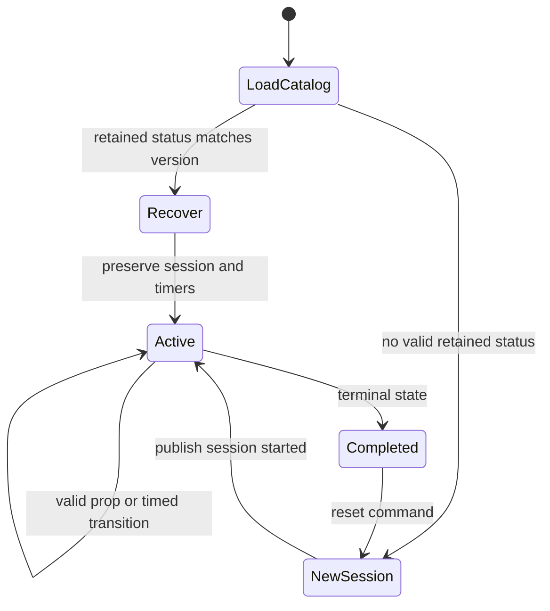

# Room Control FSM contract

Each Room Control container owns one FSM and retrieves its strategy from Catalog
over REST. No strategy file is mounted into the container.

## Strategy rules

- `room_id`, `name`, `version`, `initial_state` and at least two states required;
- `initial_state` and every transition target must exist;
- at least one state must set `is_terminal: true`;
- event transitions require `PropEvent`, `prop_id`, `interaction_type`, `value`;
- time transitions require a strictly positive `duration_seconds`;
- allowed actions: `lockDoor`, `unlockDoor`, `setLights`, `playAudio`,
  `publishStatus`;
- action-specific parameters are semantically validated.

Invalid strategies fail visibly. There is no fallback to another room's rules.

## Lifecycle

Every session has a generated `session_id`, `started_at` and real elapsed
duration. Every transition publishes source, target, trigger, prop identifier
and seconds spent in the previous state. Analytics uses these historical
durations for bottleneck analysis.

## Recovery

Room Control subscribes to its retained status before constructing the FSM. It
restores only if room ID, state and strategy version are valid. It does not
replay `on_enter` actuator actions, create a new session or emit a duplicate
session-end event. For a recovered timed state, it schedules only the remaining
duration.

## Hot reload

`PUT /config/<room_id>` validates and atomically stores the strategy in Catalog,
then publishes retained `catalog/<room_id>/config-update`. Room Control fetches
the new version over REST. It preserves the current state when that state still
exists; otherwise it starts a clean session.

