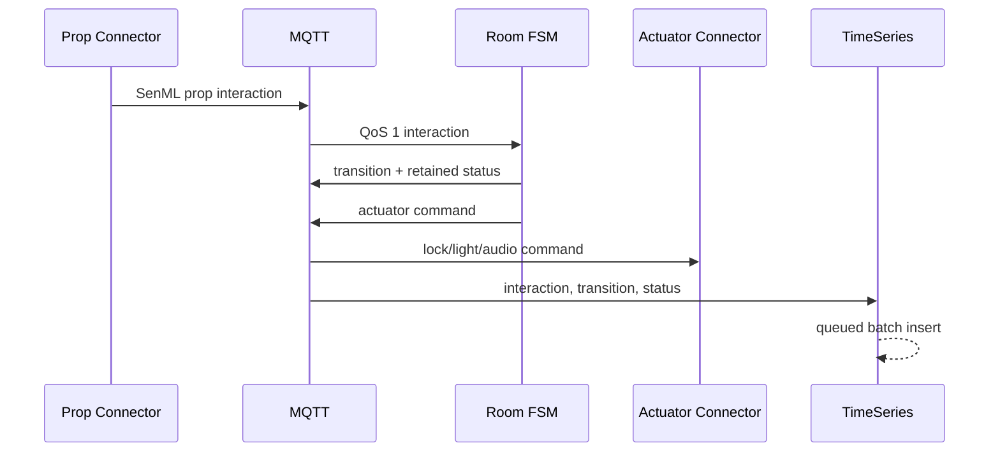
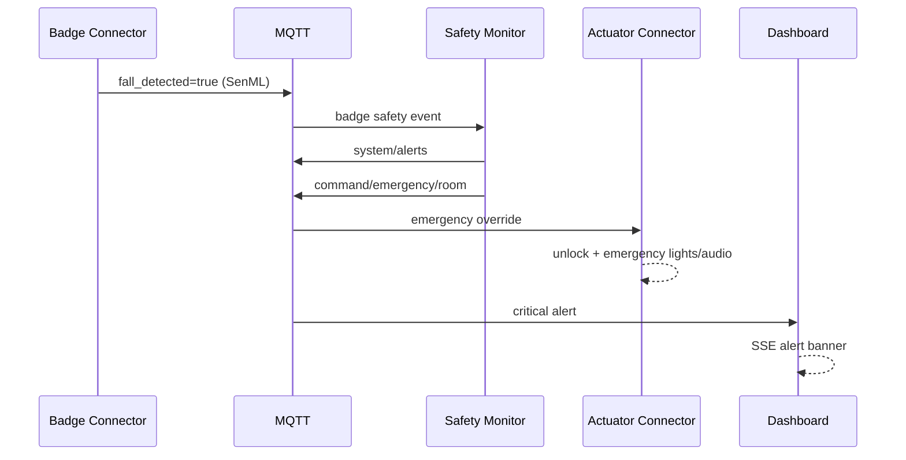
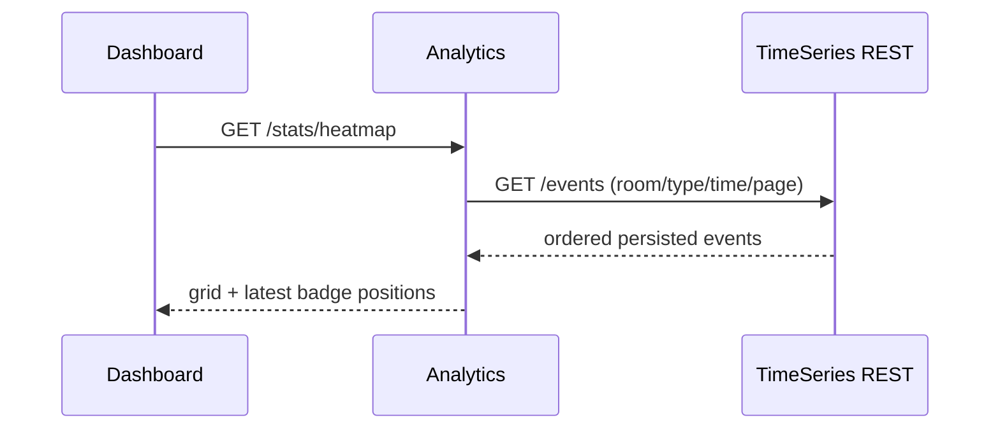

# Runtime sequences

## Puzzle progression and persistence

```mermaid
sequenceDiagram
    participant P as Prop Connector
    participant M as MQTT
    participant F as Room FSM
    participant A as Actuator Connector
    participant T as TimeSeries
    P->>M: SenML prop interaction
    M->>F: QoS 1 interaction
    F->>M: transition + retained status
    F->>M: actuator command
    M->>A: lock/light/audio command
    M->>T: interaction, transition, status
    T-->>T: queued batch insert
```

## Safety override

```mermaid
sequenceDiagram
    participant B as Badge Connector
    participant M as MQTT
    participant S as Safety Monitor
    participant A as Actuator Connector
    participant D as Dashboard
    B->>M: fall_detected=true (SenML)
    M->>S: badge safety event
    S->>M: system/alerts
    S->>M: command/emergency/room
    M->>A: emergency override
    A-->>A: unlock + emergency lights/audio
    M->>D: critical alert
    D-->>D: SSE alert banner
```

## Historical analytics

```mermaid
sequenceDiagram
    participant D as Dashboard
    participant N as Analytics
    participant T as TimeSeries REST
    D->>N: GET /stats/heatmap
    N->>T: GET /events (room/type/time/page)
    T-->>N: ordered persisted events
    N-->>D: grid + latest badge positions
```

