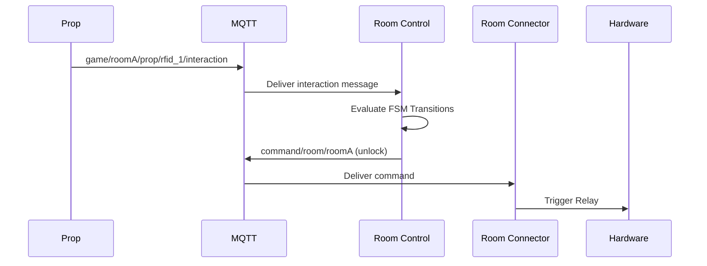
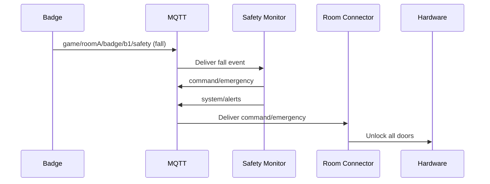

# Sequence Diagrams

## FSM Transition and Action

```mermaid
sequenceDiagram
    Prop->>MQTT: game/roomA/prop/rfid_1/interaction
    MQTT->>Room Control: Deliver interaction message
    Room Control->>Room Control: Evaluate FSM Transitions
    Room Control->>MQTT: command/room/roomA (unlock)
    MQTT->>Room Connector: Deliver command
    Room Connector->>Hardware: Trigger Relay
```

## Safety Override

```mermaid
sequenceDiagram
    Badge->>MQTT: game/roomA/badge/b1/safety (fall)
    MQTT->>Safety Monitor: Deliver fall event
    Safety Monitor->>MQTT: command/emergency
    Safety Monitor->>MQTT: system/alerts
    MQTT->>Room Connector: Deliver command/emergency
    Room Connector->>Hardware: Unlock all doors
```
